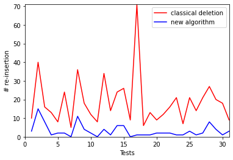

# Deletion in Two-Dimensional Quad Trees

A Point Quad Tree is an unbalanced tree data structure that divides a two-dimensional space into four quadrants: Northeast, Northwest, Southwest, and Southeast (numbered 1, 2, 3, 4). This data structure is often used for spatial indexing, image representation, and sparse data storage, making it valuable in various applications, such as geographical information systems and image processing.

## About Point Quad Trees

In this project, I focus on Point Quad Trees, a specific type of quad tree where each subdivision's center always corresponds to a point. I've implemented and tested an efficient deletion algorithm for two-dimensional Point Quad Trees, inspired by Hanan Sarnet's work from the University of Maryland [1].

## Repository

This repository serves as a resource for those interested in understanding, utilizing, or further improving the Point Quad Tree data structure and its associated operations. To use this implementation and explore the results of the efficient deletion algorithm, refer to the code and experiments in the appendix.

## Results

The experiment showed that the new deletion algorithm significantly reduces the number of re-insertions compared to the classical method in Quad Trees. This underscores the algorithm's efficiency and its potential to minimize structural changes in the Quad Tree.

---

[1] Hanan Sarnet, "Deletion in Quad Trees," University of Maryland.

For further details and the full code, please refer to the project's files in the repository.
